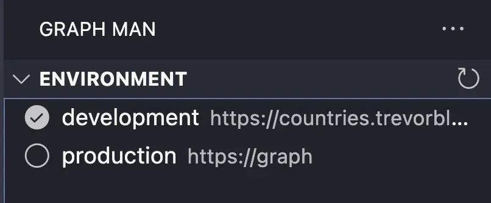
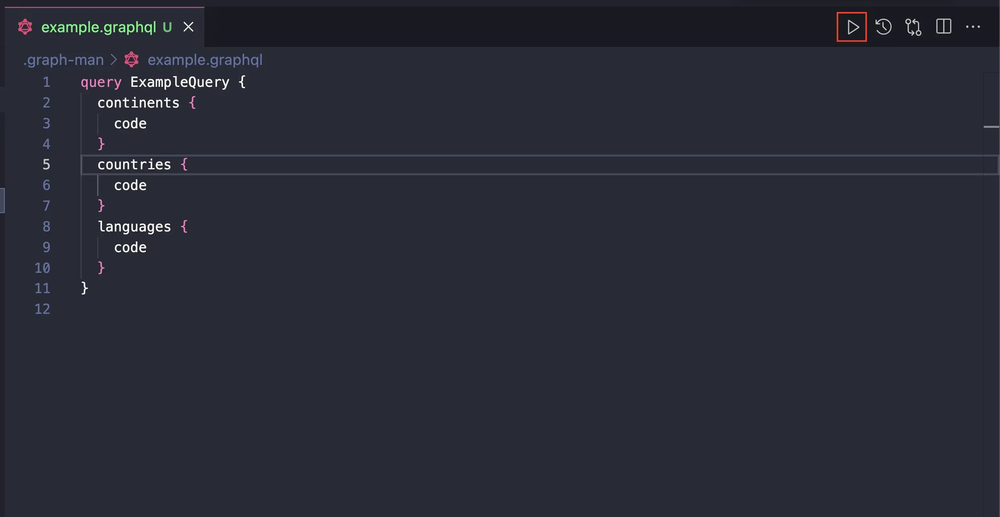
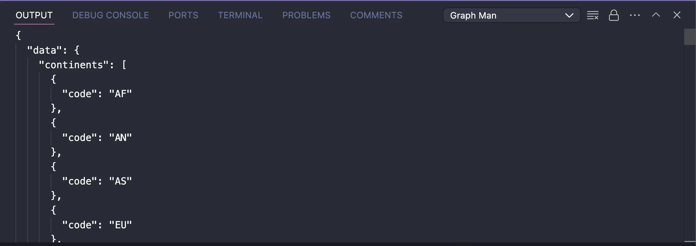

# graph-man
     

This Extension is a Tester for GraphQL Queries and Mutations.

## Layout

## Features

- [x] Test GraphQL Queries And Mutations
- [x] Save Queries And Mutations
- [ ] Load Schema From URL Or File
- [X] Settings For Custom Headers
- [ ] Settings For Custom Variables

## Usage

1. Install Graph Man Extension
2. Create `.graph-man` folder in your project root
3. Create Configration File (name is `.graph-man/config.json`)
   1. Example: [config.json](.graph-man/config.json)
4. Create Queries And Mutations Files (`.graph-man/test.graphql`)
5. Select Your Environment to Side Bar

1. Run Your Query Or Mutation from (`.graph-man/**.graphql`) file

