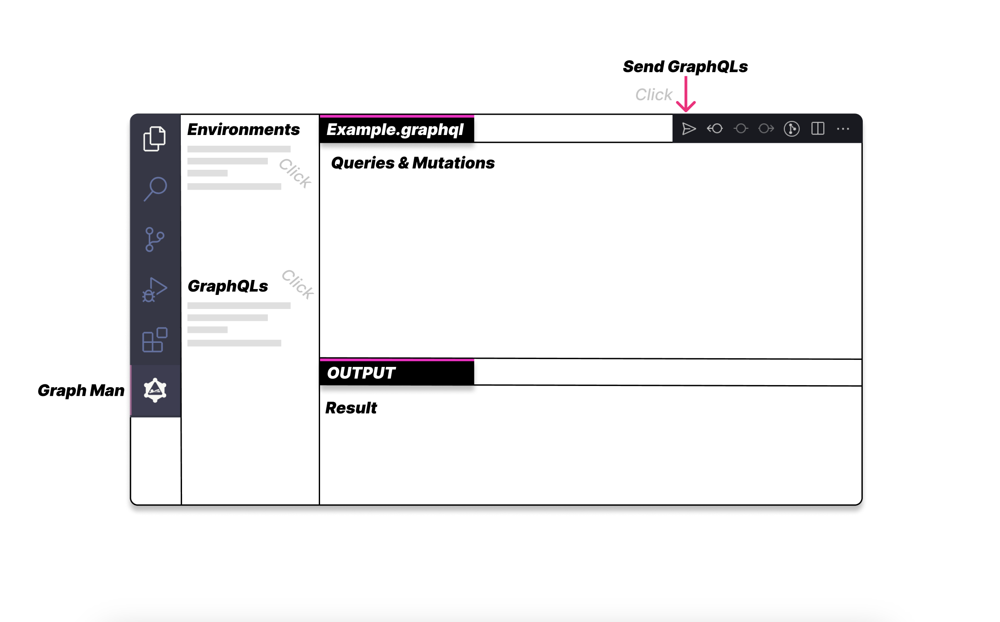

# Graph Man
     

This Extension is a Tester for GraphQL Queries and Mutations.

## Layout

## Features

- [x] Test GraphQL Queries And Mutations
- [x] Save Queries And Mutations
- [x] Settings For Custom Headers
- [ ] Load Schema From URL Or File
- [ ] Merge Fragments into Query

## Usage

1. Install Graph Man Extension
2. Create `.graph-man` folder in your project root
3. Create Configration File (name is `.graph-man/config.json`)
   - [Example Config File](https://github.com/gitsunmin/bun-graphql-server/blob/main/.graph-man/config.json)
4. Create Queries And Mutations Files (`.graph-man/**/*.graphql`)
   - [Example Query File](https://github.com/gitsunmin/bun-graphql-server/blob/main/.graph-man/pet/query-pets.graphql).
5. Select Your Environment to Side Bar   
6. Click the "paper airplane icon" on Right-Top  for Send Your "Query" Or "Mutation" on `.graph-man/**/*.grapql` file

## Example

[here](https://github.com/gitsunmin/bun-graphql-server)    
It's a "graphql-server" that uses "graph-man." You can learn more about how to use it in this project.
